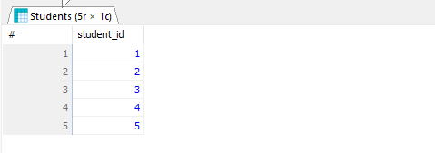

# Lab Report 03
**Course:** Database Management System  (CSEC-322)<br />
**Lab Report On:** SQL Queries for Student and Course Management <br/>
## Create and Use Database
```sql
CREATE DATABASE Student_Details;
USE Student_Details;
```
## Create Tables
```sql
CREATE TABLE Courses (
    course_id INT PRIMARY KEY,
    course_title VARCHAR(255) NOT NULL,
    department VARCHAR(255) NOT NULL,
    credits INT NOT NULL
);

CREATE TABLE Instructors (
    instructor_id INT PRIMARY KEY,
    name VARCHAR(255) NOT NULL,
    salary DECIMAL(10, 2) NOT NULL
);

CREATE TABLE Students (
    student_id INT PRIMARY KEY,
    student_name VARCHAR(255) NOT NULL
);

CREATE TABLE Sections (
    section_id INT PRIMARY KEY,
    course_id INT,
    instructor_id INT,
    term VARCHAR(255),
    FOREIGN KEY (course_id) REFERENCES Courses(course_id),
    FOREIGN KEY (instructor_id) REFERENCES Instructors(instructor_id)
);

CREATE TABLE Enrollments (
    student_id INT,
    section_id INT,
    PRIMARY KEY (student_id, section_id),
    FOREIGN KEY (student_id) REFERENCES Students(student_id),
    FOREIGN KEY (section_id) REFERENCES Sections(section_id)
);

```

## Insert Sample Data
```sql

Insert sample data into the Courses table.
------------------------------------------------

INSERT INTO Courses (course_id, course_title, department, credits)
VALUES
    (101, 'Introduction to Computer Science', 'CSE', 3),
    (102, 'Data Structures', 'CSE', 3),
    (103, 'Algorithms', 'CSE', 4);

Insert sample data into the Instructors table.
------------------------------------------------

INSERT INTO Instructors (instructor_id, name, salary)
VALUES
    (1, 'Einstein', 80000.00),
    (2, 'Harun-Ar-Rasid', 82000.00),
    (3, 'Sakib-Sarker', 55000.00);

Insert sample data into the Students table.
------------------------------------------------

INSERT INTO Students (student_id, student_name)
VALUES
    (1, 'Sabbir'),
    (2, 'Sazid'),
    (3, 'Sanmoon'),
    (4, 'Himel'),
    (5, 'Abbasi');

Insert sample data into the Sections table.
------------------------------------------------

INSERT INTO Sections (section_id, course_id, instructor_id, term)
VALUES
    (1, 101, 1, 'Fall 2017'),
    (2, 102, 2, 'Fall 2017'),
    (3, 103, 1, 'Fall 2017');


Insert sample data into the Enrollments table.
------------------------------------------------

INSERT INTO Enrollments (student_id, section_id)
VALUES
    (1, 1), (2, 1), (3, 2), (4, 3), (5, 1), 
    (2, 3), (3, 1), (1, 2);

```

## Task_a: Find the titles of courses in the Comp. Sci. department that have 3 credits.
```sql
SELECT course_title
FROM Courses
WHERE department = 'CSE'
  AND credits = 3;
```
### Output of Quesion_a


## Task_b: Find the IDs of all students who were taught by an instructor named Einstein; make sure there are no duplicates in the result.
```sql
SELECT s.student_id
FROM Students s
JOIN Enrollments e ON s.student_id = e.student_id
JOIN Sections sec ON e.section_id = sec.section_id
JOIN Instructors i ON sec.instructor_id = i.instructor_id
WHERE i.name = 'Einstein'
GROUP BY s.student_id;
```
### Output of Quesion_b


## Task_c: Find the highest salary of any instructor.
```sql
SELECT MAX(salary) AS highest_salary
FROM Instructors;

```
### Output of Quesion_c


## Task_d: Find all instructors earning the highest salary (there may be more than
## one with the same salary)
```sql
SELECT name, salary
FROM Instructors
WHERE salary = (SELECT MAX(salary) FROM Instructors);

```
### Output of Quesion_d


## Task_e: Find the enrollment of each section that was offered in Fall 2017.
```sql
SELECT s.section_id, c.course_title, COUNT(e.student_id) AS enrollment_count
FROM Sections s
JOIN Enrollments e ON s.section_id = e.section_id
JOIN Courses c ON s.course_id = c.course_id
WHERE s.term = 'Fall 2017'
GROUP BY s.section_id, c.course_title;

```
### Output of Quesion_e


## Task_f: Find the maximum enrollment, across all sections, in Fall 2017.
```sql
SELECT MAX(enrollment_count) AS max_enrollment
FROM (
    SELECT COUNT(e.student_id) AS enrollment_count
    FROM Sections s
    JOIN Enrollments e ON s.section_id = e.section_id
    WHERE s.term = 'Fall 2017'
    GROUP BY s.section_id
) AS SectionEnrollments;
```
### Output of Quesion_f


## Task_g: Find the sections that had the maximum enrollment in Fall 2017.
```sql

SELECT s.section_id, c.course_title, COUNT(e.student_id) AS enrollment_count
FROM Sections s
JOIN Enrollments e ON s.section_id = e.section_id
JOIN Courses c ON s.course_id = c.course_id
WHERE s.term = 'Fall 2017'
GROUP BY s.section_id, c.course_title
HAVING COUNT(e.student_id) = (
    SELECT MAX(enrollment_count)
    FROM (
        SELECT COUNT(e.student_id) AS enrollment_count
        FROM Sections s
        JOIN Enrollments e ON s.section_id = e.section_id
        WHERE s.term = 'Fall 2017'
        GROUP BY s.section_id
    ) AS SectionEnrollments
);
```
### Output of Quesion_g


